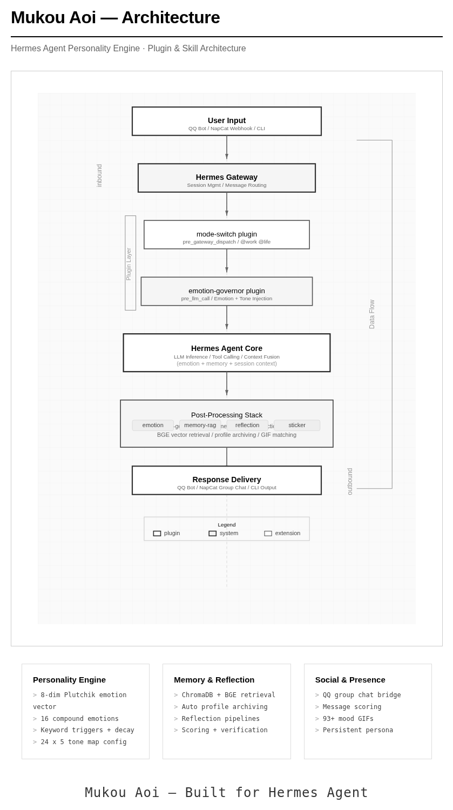
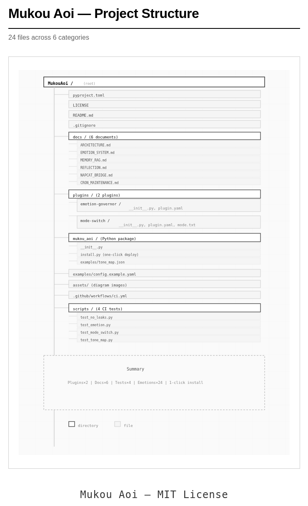

<p align="center">
  <a href="README.md"><kbd style="display:inline-block;padding:8px 24px;margin:3px;background:#1a1a1a;color:#fff;border-radius:7px;font-weight:600;font-size:14px;border:1px solid #444;box-shadow:0 2px 4px rgba(0,0,0,0.3)">English</kbd></a>
  <a href="README.zh.md"><kbd style="display:inline-block;padding:8px 24px;margin:3px;background:#f6f8fa;color:#333;border-radius:7px;font-weight:600;font-size:14px;border:1px solid #d0d7de;box-shadow:0 1px 3px rgba(0,0,0,0.06)">中文</kbd></a>
  <a href="https://qm.qq.com/q/721815130" target="_blank"><kbd style="display:inline-block;padding:8px 24px;margin:3px;background:#07C160;color:#fff;border-radius:7px;font-weight:600;font-size:14px;border:1px solid #06ad56;box-shadow:0 2px 4px rgba(7,193,96,0.3)">Join QQ Group</kbd></a>
  <a href="mailto:ofgm@foxmail.com"><kbd style="display:inline-block;padding:8px 24px;margin:3px;background:#4A90D9;color:#fff;border-radius:7px;font-weight:600;font-size:14px;border:1px solid #3a7bc8;box-shadow:0 2px 4px rgba(74,144,217,0.3)">✉ ofgm@foxmail.com</kbd></a>
</p>

# Mukou Aoi — Hermes Agent Personality Engine Kit

Give your AI Agent a soul — not just answers, but presence.

**Mukou Aoi** is a personality engine kit built for [Hermes Agent](https://github.com/NousResearch/hermes-agent). It's not another AI framework — it's a collection of plugins and skills that give your agent emotions, memory, consistent personality, and social capabilities.

---

## Architecture

<p align="center">
  <a href="assets/architecture-v2.png" target="_blank"></a>
</p>

See [docs/ARCHITECTURE.md](docs/ARCHITECTURE.md) for details.

---

## Components

| Component | Description |
|-----------|-------------|
| Emotion Governor | 8-dimensional Plutchik emotion vector with keyword triggers, 16 compound emotions, natural fluctuation decay, and style injection |
| Mode Switch | `@work` / `@life` mode switching with automatic response length constraints in life mode |
| Memory RAG | ChromaDB + BGE vector retrieval for persistent agent memory |
| Reflection System | Automatic profile archiving, individual/recent reflection pipelines, scoring engine with evidence verification |
| QQ Bridge | NapCat + Webhook group chat bridge with message scoring, session management, and multi-group support |
| Sticker System | Emotion-matched GIF auto-append for more expressive conversations |

Combined with SOUL.md / MEMORY.md persistent persona configuration, the agent retains identity across restarts.

---

## Prerequisites

- Hermes Agent (v0.15+ recommended)
- Python >= 3.11
- (Optional) ChromaDB for Memory RAG
- (Optional) SiliconFlow API Key for BGE vector embeddings
- (Optional) NapCat + Docker for QQ group chat bridge

---

## Installation

### From Source

```bash
git clone https://github.com/zhangtengjin-byte/MukouAoi.git
cd MukouAoi
pip install -e .

# One-click deploy to Hermes
mukou-aoi-install
```

### Manual Deployment

1. Copy `plugins/emotion-governor/` to `~/.hermes/hermes-agent/plugins/`
2. Copy `plugins/mode-switch/` to `~/.hermes/hermes-agent/plugins/`
3. Copy `mukou_aoi/examples/tone_map.json` to `~/.hermes/tone_map.json`
4. Enable plugins in `~/.hermes/config.yaml`
5. Restart Hermes Gateway

### Configuration Example

```yaml
# ~/.hermes/config.yaml
plugins:
  emotion-governor:
    enabled: true
  mode-switch:
    enabled: true
```

Full configuration example at [examples/config.example.yaml](examples/config.example.yaml).

---

## Documentation

| Document | Description |
|----------|-------------|
| [ARCHITECTURE.md](docs/ARCHITECTURE.md) | System architecture overview, data flow, component relationships |
| [EMOTION_SYSTEM.md](docs/EMOTION_SYSTEM.md) | Emotion system deep dive: 8-dimensional vector, 16 compound emotions, algorithms |
| [MEMORY_RAG.md](docs/MEMORY_RAG.md) | Memory RAG system: ChromaDB, vector retrieval, automatic archiving |
| [REFLECTION.md](docs/REFLECTION.md) | Reflection system: profile updates, scoring engine, verification pipeline |
| [NAPCAT_BRIDGE.md](docs/NAPCAT_BRIDGE.md) | QQ group chat bridge: NapCat deployment, dual-channel messaging, message filtering, session management |
| [CRON_MAINTENANCE.md](docs/CRON_MAINTENANCE.md) | Cron jobs: emotion fluctuation, reflection, profile update, memory detox (required); NapCat monitoring, morning news, daily summary (optional) |

---

## Customization

### Emotion Expression

Edit `~/.hermes/tone_map.json` to customize per-emotion:
- **Style description**: Agent's tone under each emotion state
- **Example sentences**: Templates injected into LLM context
- **Particles**: Sentence-ending particles list
- **Banned words**: Words prohibited in the current emotional state
- **Emoji**: Emoticons corresponding to each emotion

### Keyword Mapping

Edit `~/.hermes/emotion_map.json` to configure:
- `_verb_emotions`: Verb-to-emotion mapping
- `_adjective_emotions`: Adjective-to-emotion mapping
- `_negation_keywords`: Negation word list
- `_intensity_map`: Adverb-to-intensity multipliers

### Agent Identity

Modify `AGENT_PRONOUNS` and `USER_PRONOUNS` in `plugins/emotion-governor/__init__.py`:

```python
AGENT_PRONOUNS = ["YourAgentName", "your-agent"]
USER_PRONOUNS = ["User", "user"]
```

---

## Project Structure

<p align="center">
  <a href="assets/structure-1780516769.png" target="_blank"></a>
</p>

---

## Contributing

If you have ideas for making AI agents more human, feel free to open an Issue or PR.

---

## License

MIT License — free to use, modify, and distribute. Retain the original copyright notice.

---

## Acknowledgements

- [Hermes Agent](https://github.com/NousResearch/hermes-agent) — The underlying AI Agent framework
- [西园寺の双黄又蛋蛋](https://github.com/GiriYomi) — Provided valuable ideas and insights
- [Dear Mr. N.A.](mailto:1065696132@qq.com) — Provided stress test group chat channels
- [ChromaDB](https://www.trychroma.com/) — Vector database
- [NapCat](https://napcat.napneko.icu/) — QQ framework
